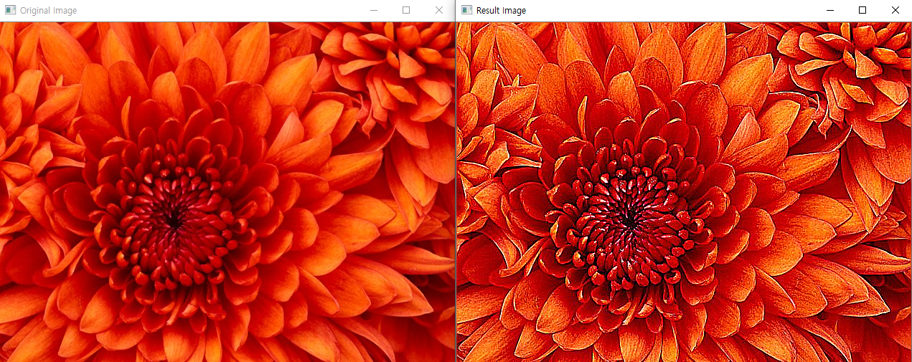

📦 Toy Box] Traditional Image Processing
====
## 📋 Table of content
- [Environment Setting](#EnvironmentSetting) 
- [Brightness & Darkness](#Brightness&Darkness) 
- [Composition](#Composite) 
- [Contrast Stretching](#ContrastStretching) 
- [Mosaic](#Mosaic) 
- [Histogram Equalization](#HistogramEqualization) 
- [Blurring & Sharpening](#Blurring&Sharpening) 
- [Edge Detection](#EdgeDetection) 
- [Template Matching](#TemplateMatching) 
- [Labeling](#Labeling) 
---
## Environment Setting 
- Microsoft Visual Studio 2017 (v141)
- OpenCV == 3.4.1
- Windows SDK version == 8.1
- Release/x64
---
## ✨ Brightness & Darkness 
- `Brightness.cpp`
- 
### Brightness

### Darkness

---
## ➕ Composition 
- `Composite.cpp`
### Result

---
## 🽠Contrast Stretching 
- `ContrastStretching.cpp`
### Result

---
## 🌠Mosaic 
- `Mosaic.cpp`
### Result

---
## ⚖ Histogram Equalization 
- `Histogram_Equalization.cpp`
### Result

---
## 🔪 Blurring & Sharpening 
- `Blurring_Sharpening.cpp`
- 
### Blurring

### Sharpening - Laplacian kernel 1

### Sharpening - Laplacian kernel 2

---
## 🔠Edge Detection 
- `Edge_Detection.cpp`
- 
### Horizontal kernel

### Vertical kernel

### Diagonal kernel 1

### Diagonal kernel 2

### ALL kernel

---
## ✅ Template Matching 
- `Template_Matchng.cpp`
### Result

---
## 🷠Labeling 
- `Labeling.cpp`
### Result

